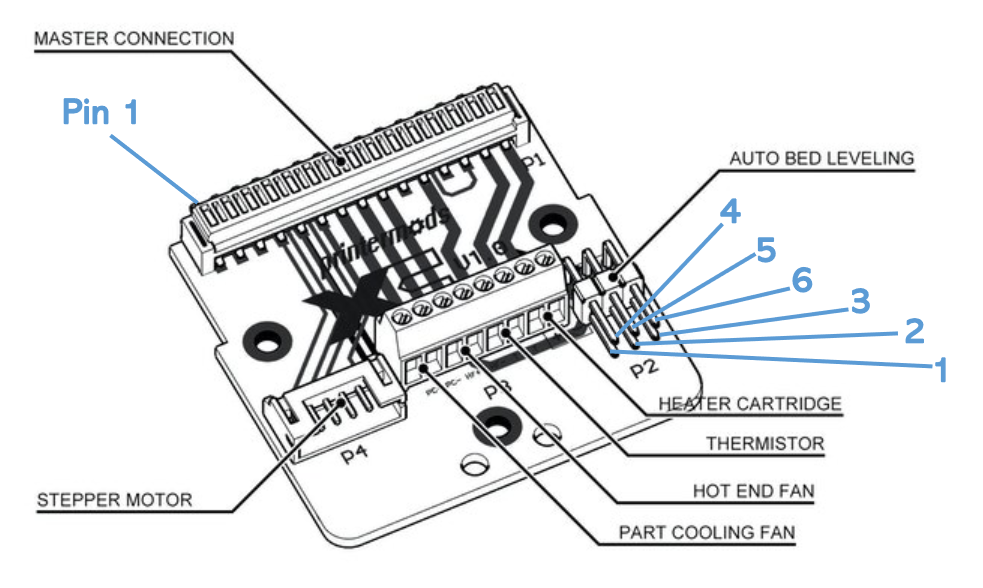
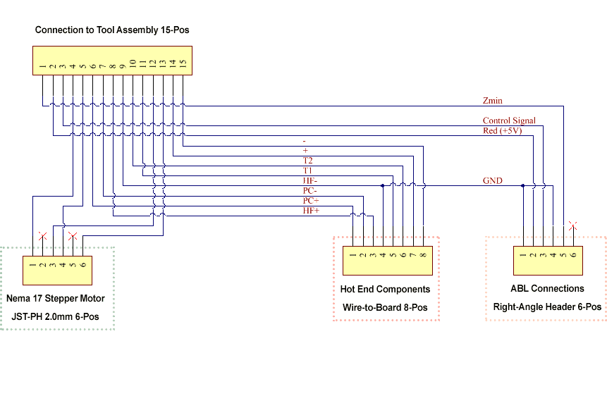
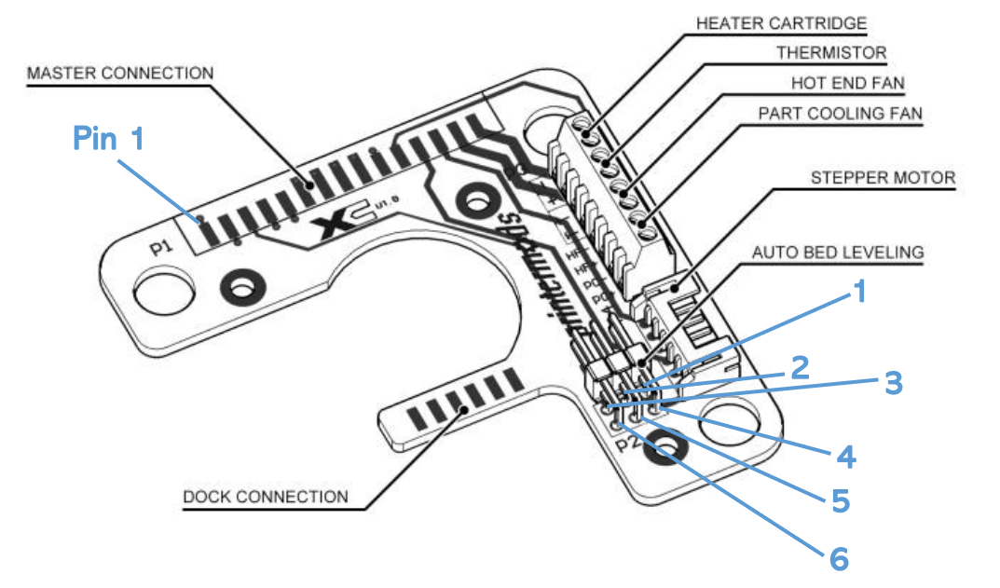
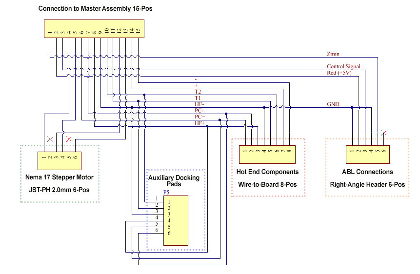

# Master PCB

# Tool PCB

# Pin Assignments
| **Pin** | **Label** | **Purpose** | **Wire** | **Comment** |
| --- | --- | --- | --- | --- |
| Stepper 1 | Stepper Motor Connector | | Often Red | |
| Stepper 2 | Stepper Motor Connector | | | Non-connected pin |
| Stepper 3 | Stepper Motor Connector | | Often Black | |
| Stepper 4 | Stepper Motor Connector | |  Often Blue | |
| Stepper 5 | Stepper Motor Connector | | | Non-connected pin |
| Stepper 6 | Stepper Motor Connector | | Often Green | |
| Hot End 1 | PC+ | Part Cooling Fan + | Often Red | Polarity (+/-) matters |
| Hot End 2 | PC- | Part Cooling Fan - | Often Black | Polarity (+/-) matters |
| Hot End 3 | HF+ | Hot End Fan + | Often Red (Creality often Yellow) | Polarity (+/-) matters |
| Hot End 4 | HF- | Hot End Fan - | Often Black (Creality often Blue) | **Shared Ground Pin!** Polarity (+/-) matters |
| Hot End 5 | T1 | Temperature Sensor | Often White | Polarity usually does not matter |
| Hot End 6 | T2 | Temperature Sensor | Often White | Polarity usually does not matter |
| Hot End 7 | + | Heater + | Often Red | Polarity usually does not matter |
| Hot End 8 | - | Heater - | Often Red | Polarity usually does not matter |
| ABL 1 | GND | Auto Bed Level - | Often Brown | **Shared Ground Pin!** Polarity (+/-) matters
| ABL 2 | +5V | Auto Bed Level + | Often Red | Polarity (+/-) matters |
| ABL 3 | Control | Auto Bed Level Control | Often Yellow | Polarity (+/-) matters |
| ABL 4 | GND | Auto Bed Level - | Often Black | **Shared Ground Pin!** Polarity (+/-) matters |
| ABL 5 | Zmin | Auto Bed Level Endstop | Often White | Polarity (+/-) matters |
| ABL 6 | | Auto Bed Level | | Non-connected pin |

## Notes
- Some boards may require the ABL/BLTouch Zmin pin to be wired ‘in reverse’. Please mind the shared ground pins on XChange and apply a voltage to these pins which may result in damage of electrical components.
- The shared ground pins require great care in case one would want to make the Hot End Fan controllable/switchable. Switching or sending modulated signals through the shared ground pins may result in damage of electrical components.  
  
## Credits
These diagrams apply to Printermods XChange V1.0  
  
Original files from https://github.com/printermods/xchange/blob/main/XChange%20V1.0%20-%20Wiring%20Diagrams.pdf  
Version: commit 42383b0 on 17 Jun 2021

Thank you very much to https://stackedit.io for existing!
